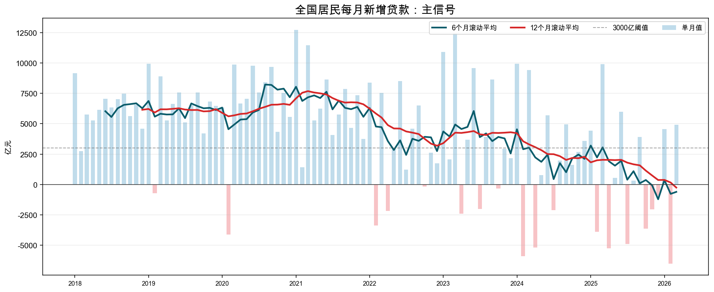
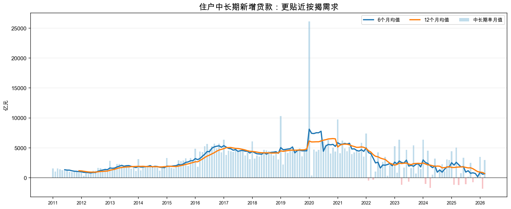
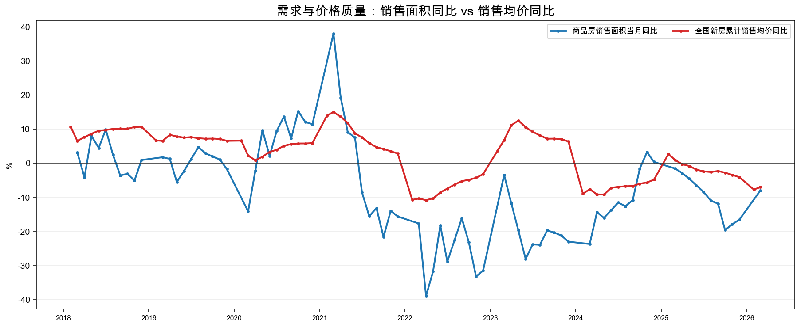
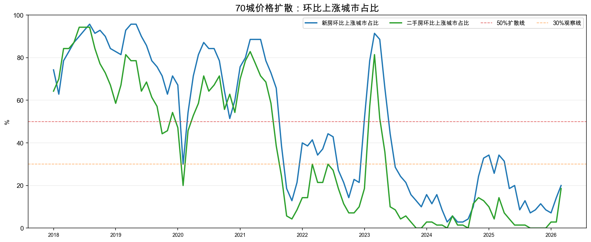
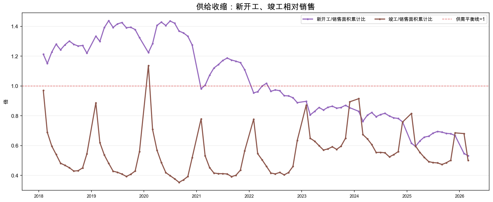
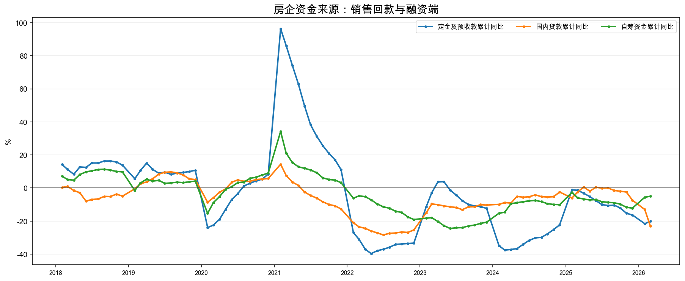
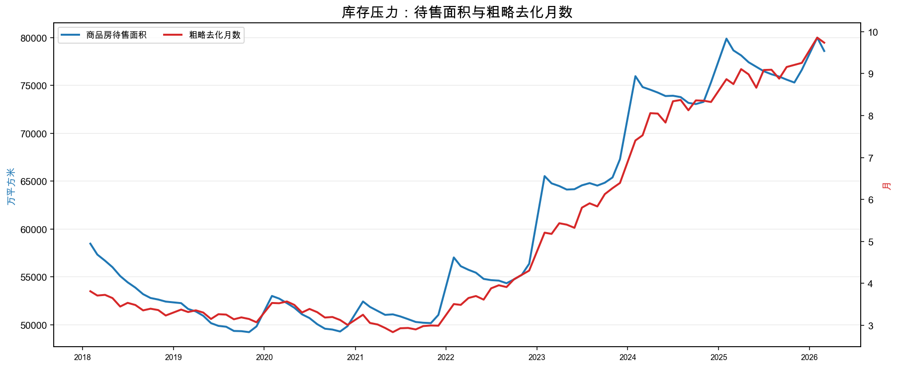
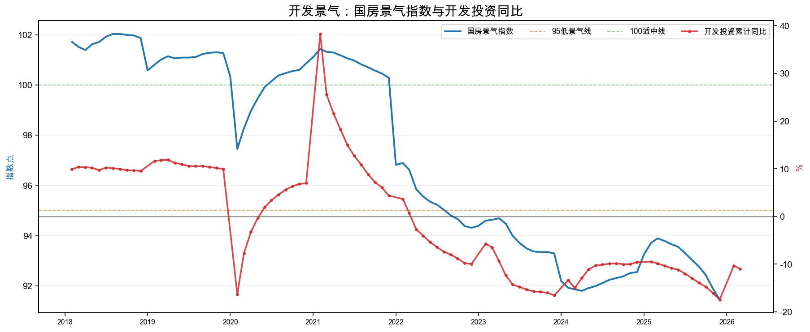

# 地产辅助指标可视化初版

生成时间：2026-05-08 23:45

## 券商报告提炼出的指标框架

- 平安证券宏观深度：销售先行，销售改善后房价企稳，再传导至投资；同时关注库存去化、居民购房能力、房价/收入预期。
- 中信证券地产策略：按揭成本和投放是需求修复起点，销售面积/销售额、房价扩散、竣工压力是关键跟踪项。
- 国泰海通地产策略：销售面积 > 新开工面积 ≈ 竣工面积 ≈ 土地购置建面，是库存出清和复苏的重要结构。

## 初版图表清单

### 1. 全国居民每月新增贷款：主信号

你的核心指标，观察 6M/12M 是否双站上 3000 亿并上穿。

### 2. 住户中长期新增贷款：更贴近按揭需求

比总住户贷款更接近房贷需求，可作为主信号质量过滤器。

### 3. 销售面积同比 vs 销售均价同比

券商普遍把销售作为房地产复苏最领先指标，价格质量用于区分量修复还是结构/价格修复。

### 4. 70城价格扩散：上涨城市占比

观察新房/二手房价格修复是否从少数城市扩散到多数城市。

### 5. 供给收缩：新开工、竣工相对销售

国泰海通等强调销售强于新开工/竣工时，有利于库存出清。

### 6. 房企资金来源：销售回款与融资端

定金预收款反映购房付款，国内贷款反映房企融资修复。

### 7. 库存压力：待售面积与粗略去化月数

待售面积是狭义库存，去化月数用于观察库存压力。

### 8. 开发景气：国房景气指数与开发投资同比

国房景气指数是统计局综合景气指标，投资同比反映开发端收缩/修复。

## 下一步建议

1. 把 `个人住房贷款余额/季度增减`、`房地产贷款余额`、`开发贷余额` 接入央行贷款投向报告。
2. 补 `土地成交建面/溢价率/流拍率`，否则供给前端还不完整。
3. 补重点城市二手房成交套数/面积，二手房是价格发现更敏感的指标。
4. 图表口径后续建议分为：主信号、需求、价格、库存、供给、资金、政策/利率七组。
